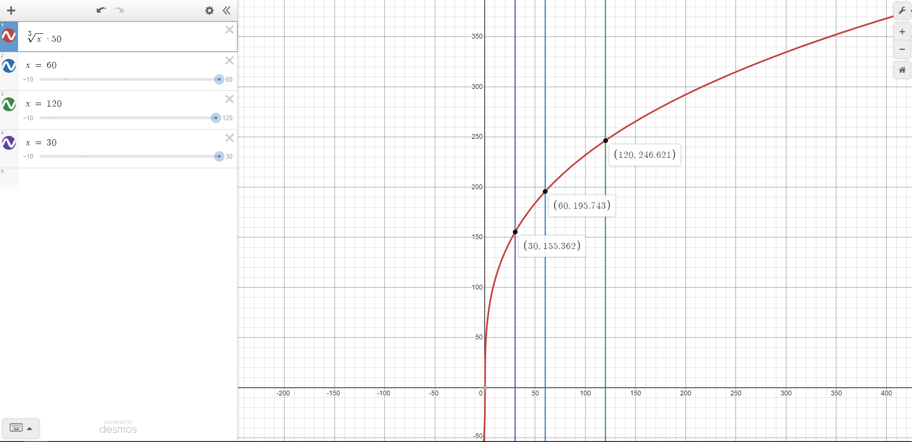

# Infinite Mode Management Scripts

## All of the scripts that manage the various functions of Infinite Mode, as well as player movement.

  

## Design philosophy:

#### Player movement and player stats are split into two scripts for better management, though they are on different GameObjects due to oversight when designing the player prefab early in development. If they were on the same GameObject, they would be much easier to manage, but right now changing it would be too much effort for too little reward.

###### The function for money earned after each wave (X is time remaining):

#### WaveManager.cs contains all of the information regarding wave difficulty, and thus needs to be available to the enemy scripts. Spawners and RandomWalls provide randomness each wave that keeps the player on their toes and makes it more difficult to cheese the waves (which was encouraged by the poor design in the early builds).

#### Market.cs contains all of the button scripts used in the between wave market breaks. The code is incredibly simple: The first time it is started, it stores all of the UI elements through code (it would have been tedious to do this manually at the cost of an unoptimal start). Then each successive enable updates the UI elements to reflect the current state of the game. Each button checks if the player has enough money and is under an arbitrary limit, and, if so, proceeds with the purchase and updates that UI.