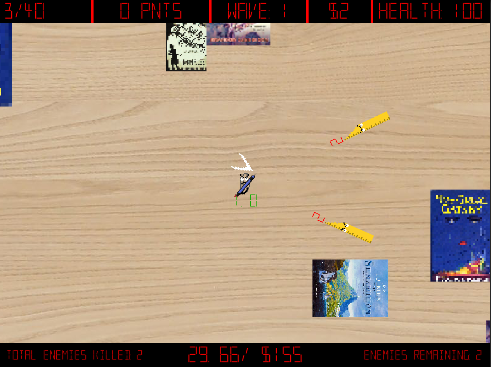
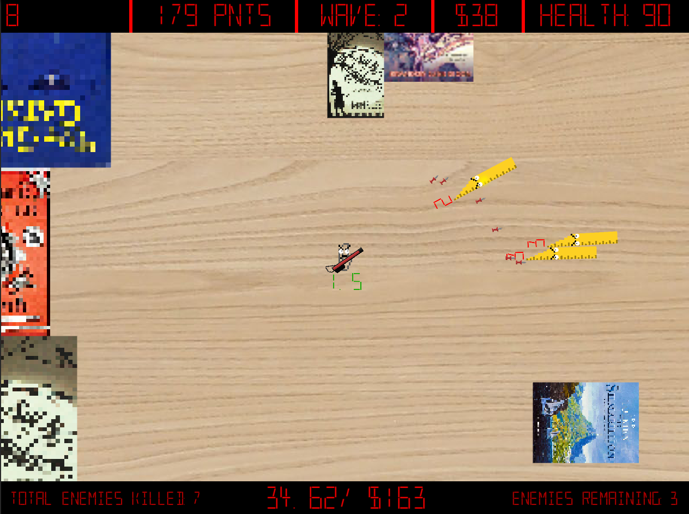
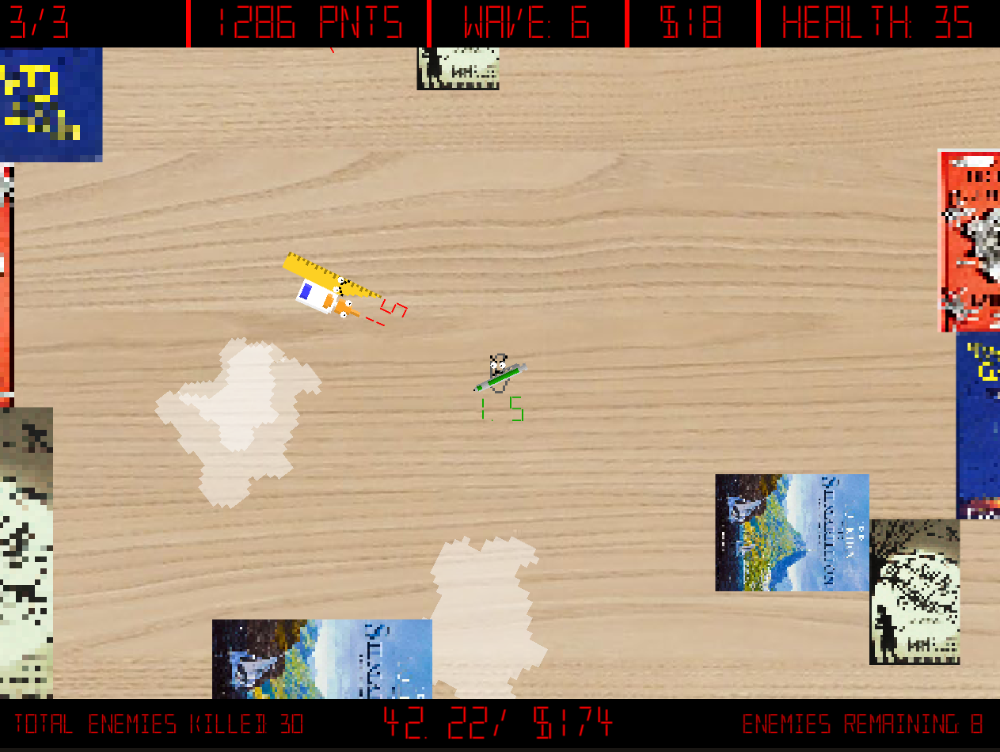
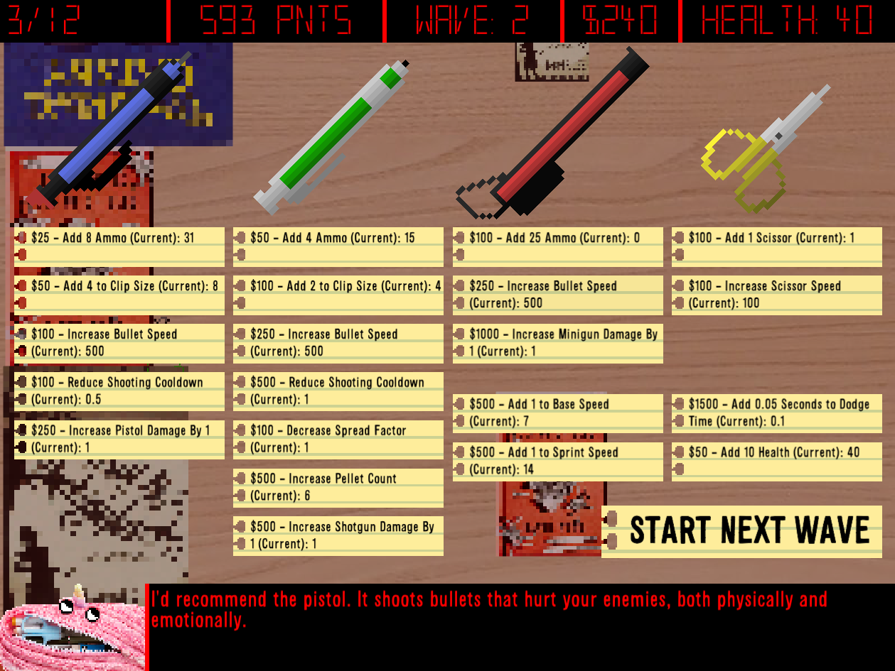
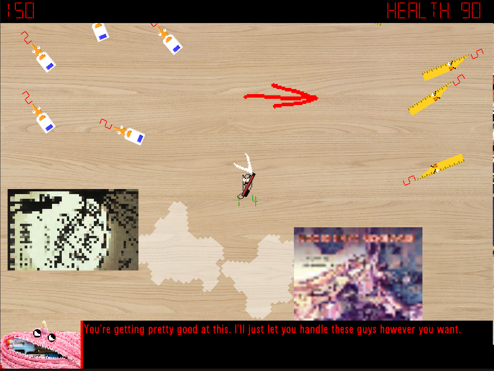

# Want to play the game? [Just click here!](https://beanmeister12.itch.io/clippy-commando)

  

# Clippy Commando - A 2D top-down shooter made in Unity

## This repository contains the assets, packages, and Unity project settings to run a 2D *Unity 2020.3.1f1* project. 

### If you want to open the project in Unity on your own device:
##### 1. Clone the repository to your Unity Projects folder (on Windows, this should be in your Documents folder).
##### 2. Open the project through Unity Hub (make sure the version is *Unity 2020.3.1f1*). 
##### 3. Unity will add all the necessary files not included in the GitHub project, and you can interact with the code and assets in the engine.
##### 4. Once inside the project, you can play the game by opening the MainMenu scene (Assets/Scenes/MainMenu). All code is stored in Assets/Scripts. Various READMEs have been added throughout the project to provide further context if needed.

  

### Gameplay screenshots

